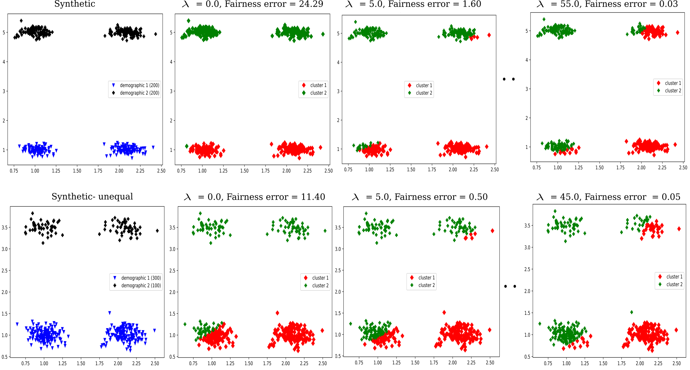

# Variational Fair Clustering
This is the code for the AAAI 2021 paper: **[Variational Fair Clustering](https://arxiv.org/abs/1906.08207)**. This clustering method helps you to find clusters with specified proportions of different demographic groups pertaining to a sensitive attribute of the dataset (e.g. race, gender etc.), for any well-known clustering method such as K-means, K-median or Spectral clustering (Normalized cut) etc. in a flexible and scalable way.

## Requirements
1. The code is tested on python 3.6. Install the requirements listed in ([requirements.txt](./requirements.txt)) using pip or conda.
2. Download the datasets other than the synthetics from the respective links given in the paper and put in the respective [data/[dataset]](./data) directory.

## Usage
To evaluate the code simply run the following script: 
```
sh evaluate_Fair_clustering.sh
```
Change the options inside the scripts accordingly. The options are fairly described in the ([test_fair_clustering.py](./test_fair_clustering.py)).  Note that, the weight of the fairness term (--lmbda) can be much higher (even more than 100) to impose fairness. --lmbda works as a trade-off between the clustering objective and fairness as discussed in the paper.

## Example

For _Synthetic_ dataset with two equal demographic groups (50/50) and _Synthetic-unequal_ dataset with uneven proportions (75/25), we can impose the required proportions according to the dataset while clustering by increasing the weight of the fairness term (--lmbda). With a suitable lambda we can get the required given proportions in each cluster.

<div align="center"></div>
