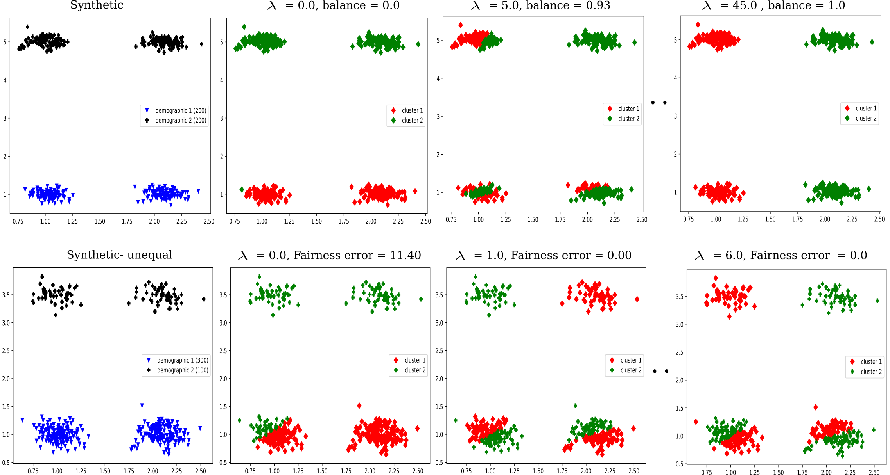

# Clustering-with-fairness-constraints
This is the code for the paper **[Clustering With Fairness Constraints: A Flexible and Scalable approach](https://arxiv.org/abs/1906.08207)**. This clustering method helps you to find clusters with specified proportions of different demographic groups pertaining to a sensitive attribute of the dataset (e.g. race, gender or sex etc.), for any well-known clustering method such as K-means, K-median or Spectral clustering (Normalized cut) etc. in a flexible and scalable way.

## Prerequisites

The code is based on python 3.6 and need the Pandas and Matplotlib libraries.

## Usage
To evaluate the code simply run the following which put the outputs in the [outputs](./outputs) folder.
```
sh evaluate_Fair_clustering.sh
```
For different dataset and parameters change the above script according to the required arguments described in [test_fair_clustering.py](./test_fair_clustering.py).

## Example

For _Synthetic_ dataset with two equal demographic groups (50/50) and _Synthetic-unequal_ dataset with uneven proportions (75/25), we can impose the required proportions according to the dataset while clustering by increasing the weight of the $\lambda$ parameter for the fairness. With a suitable lambda we can get the required given proportions in each cluster.

<div align="center"></div>
